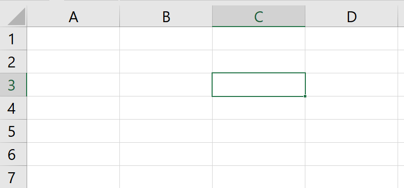

# taller de computacion :computer:
## tarea 998

## 21/08/2025 

hoy inicie sesion en discord y me puse al corriente con mis tareas

## tarea 996
[cvespañol](CV.pdf)

[cvingles](Cvingles.pdf)

## tarea 995

Todo Microsoft Office 2016 incluye el área Backstage. En Backstage, puedes administrar, guardar y abrir tus archivos. Aquí también puedes imprimir, seleccionar plantillas y realizar otras tareas útiles. Analicemos el Backstage en profundidad. Primero, haz clic en la pestaña Archivo (en la esquina superior izquierda de la ventana).

La primera página que verá es la página de información. Esta página muestra el nombre, el tamaño y los autores de su archivo. También puede ver cuándo se realizó el último autoguardado. El autoguardado es la red de seguridad de Office. Periódicamente, su computadora guardará automáticamente su archivo como archivo temporal. Si se apaga su computadora, puede recuperar parte de su trabajo desde el autoguardado.

Nuevo: Puede crear un documento nuevo en blanco o seleccionarlo de la biblioteca de plantillas de Word.
Word ofrece plantillas de currículum, calendario y folletos para ayudarle a empezar.
Abrir: Haga clic en esta opción para abrir un archivo previamente guardado y seguir editándolo.
Guardar: Guarde su archivo con frecuencia. También puede hacer clic en en la esquina superior izquierda o presionar CTRL + S en el teclado simultáneamente.
Guardar como: La primera vez que guarde su archivo, verá el menú Guardar como. Consulte a continuación para obtener más información.
Guardar como Adobe PDF: Le permite guardar el documento como un archivo Adobe PDF.
Imprimir: Imprima su documento usando esta pantalla. Más adelante en la clase, explicaremos más detalles sobre esto.
Compartir: Esta función es nueva en Office 2016. Le permite enviar su archivo por correo electrónico, subirlo a un blog o presentarlo en línea. Necesitará cuentas adicionales para usar estas funciones, como una cuenta de Microsoft (para presentaciones) o una cuenta de WordPress (para blogs).
En esta introducción no profundizaremos en estas funciones, pero tenga en cuenta que existen.
Exportar: Permite exportar (o guardar) su documento como un tipo diferente.
Cuenta: Permite cambiar los colores del fondo de Office e iniciar sesión con otra cuenta de Microsoft si es necesario.
Opciones: Permite acceder a las funciones avanzadas de Word. Esta función también permite reorganizar la cinta de opciones u otras configuraciones de la aplicación.

La Cinta
La Cinta es un panel que contiene grupos funcionales de botones y listas desplegables, organizados en pestañas. Cada producto de Office cuenta con un conjunto de pestañas que corresponden a la funcionalidad de la aplicación. Cada pestaña se divide a su vez en grupos como Fuente y Párrafo.

En la esquina inferior derecha de algunos grupos, hay una flecha diagonal llamada Iniciador de cuadro de diálogo (ver Figura 4). Al hacer clic en este botón, se abre un cuadro de diálogo para ese grupo con más opciones.

Figura 4 - Lanzador de diálogos Aparecerán pestañas contextuales según la tarea en la que esté trabajando. Por ejemplo, si ha insertado imágenes, la pestaña aparecerá al seleccionar una imagen.

Figura 5 – Pestaña contextual
Personalización de la cinta de opciones
Puede ocultar o mostrar las pestañas que no utiliza o crear su propia pestaña de herramientas favoritas. A continuación, se explica cómo personalizar la cinta de opciones para crear sus propias pestañas y grupos.

Figura 6 - Pestaña Archivo (Vista Backstage)

✓ En la Vista Backstage, haga clic en Opciones.

✓ En el cuadro de diálogo Opciones de Word, haga clic en Personalizar Cinta (Ver Figura 7).

✓ Haga clic en el botón Nueva pestaña (Ver Figura 7).

✓ Se ha añadido una Nueva pestaña a la lista de Pestañas principales. En Nueva pestaña, verá que Nuevo grupo ya está seleccionado (Ver Figura 7).

✓ En la columna de la izquierda, seleccione un comando de la lista en Elegir comandos de para añadirlo al Nuevo grupo (Ver Figura 7).

✓ Haga clic en el botón Añadir (Ver Figura 7).

✓ El comando se añadirá a la pestaña Nuevo grupo.

✓ Para cambiar el nombre de la pestaña o el grupo, haga clic con el botón derecho en la Nueva pestaña o el Nuevo grupo (Ver Figura 8).

✓ Haga clic en Cambiar nombre (Ver Figura 8).

✓ Para ocultar una pestaña, quite la marca de verificación junto al nombre de la pestaña (ver Figura 8)

tarea #99
Rango en Excel
 
Un rango en Excel es una colección de dos o más celdas. Este capítulo ofrece una descripción general de algunas operaciones de rango muy importantes.

•	Celda, Fila, Columna
Comencemos seleccionando una celda, una fila y una columna.

1. Para seleccionar la celda C3, haga clic en el cuadro en la intersección de la columna C y la fila 3.

Seleccionar una celda

2. Para seleccionar la columna C, haga clic en el encabezado de la columna C.

Seleccionar una columna en Excel

3. Para seleccionar la fila 3, haga clic en el encabezado de la fila 3.

Seleccione una fila

Ejemplos de rango
Un rango es una colección de dos o más celdas.

1. Para seleccionar el rango B2:C4, haga clic en la celda B2 y arrástrela a la celda C4.

Rango en Excel

2. Para seleccionar un rango de celdas individuales, mantenga presionada la tecla CTRL y haga clic en cada celda que desee incluir en el rango.

•	Una gama de células individuales

Rellenar un rango
Para llenar un rango, ejecute los siguientes pasos.

1a. Ingrese el valor 2 en la celda B2.

Introduzca un valor

1b. Seleccione la celda B2, haga clic en la esquina inferior derecha de la celda B2 y arrástrela hasta la celda B8.
Resultado:

Esta técnica de arrastrar es muy importante y la usarás con mucha frecuencia en Excel. Aquí tienes otro ejemplo
2a. Ingrese el valor 2 en la celda B2 y el valor 4 en la celda B3.

Un patrón

2b. Seleccione las celdas B2 y B3, haga clic en la esquina inferior derecha de este rango y arrástrelo hacia abajo.

Patrón arrastrado hacia abajo

Excel rellena automáticamente el rango según el patrón de los dos primeros valores. Genial, ¿verdad? Aquí tienes otro ejemplo.

3a. Ingrese la fecha 13/6/2030 en la celda B2 y la fecha 16/6/2030 en la celda B3.

3b. Seleccione las celdas B2 y B3, haga clic en la esquina inferior derecha de este rango y arrástrelo hacia abajo.

•	Mover un rango
Para mover un rango, ejecute los siguientes pasos.

1. Seleccione un rango y haga clic en el borde del rango.

2. Arrastre el rango a su nueva ubicación.

Resultado del movimiento

Copiar/Pegar un rango
Para copiar y pegar un rango, ejecute los siguientes pasos.

1. Seleccione el rango, haga clic derecho y luego haga clic en Copiar (o presione CTRL + c).

Autocompletar en Excel
 
Usa Autorrelleno en Excel para rellenar automáticamente una serie de celdas. Esta página contiene muchos ejemplos de Autorrelleno fáciles de seguir. ¡No hay límites!

1. Por ejemplo, ingrese el valor 10 en la celda A1 y el valor 20 en la celda A2.

2. Seleccione las celdas A1 y A2 y arrastre el controlador de relleno hacia abajo. El controlador de relleno es el pequeño recuadro verde en la esquina inferior derecha de la celda o del rango de celdas seleccionado.

Nota: La función de Autocompletar completa automáticamente los números según el patrón de los dos primeros números.

3. Ingrese Jan en la celda A1.

4. Seleccione la celda A1 y arrastre el controlador de relleno hacia abajo. Autocompletar rellena automáticamente los nombres de los meses.

5. Ingrese el Producto 1 en la celda A1.

6. Seleccione la celda A1 y arrastre el controlador de relleno hacia abajo. Autocompletar rellena automáticamente los nombres de los productos.

7. Ingrese el viernes en la celda A1.

8. Seleccione la celda A1 y arrastre el controlador de relleno hacia abajo. Autocompletar rellenará automáticamente los nombres de los días.

9. Ingrese la fecha 14/01/2025 en la celda A1.

10. Seleccione la celda A1 y arrastre el controlador de relleno hacia abajo. Autocompletar rellenará los días automáticamente.

11. En lugar de completar los días, utilice las opciones de Autocompletar para completar los días de la semana (ignorando los días de fin de semana), los meses (ver el ejemplo a continuación) o los años.

Nota: vea también las opciones para rellenar solo el formato y para rellenar una serie sin formato.

12. Ingrese la fecha 14/1/2025 en la celda A1 y la fecha 21/1/2025 en la celda A2.

13. Seleccione las celdas A1 y A2 y arrastre el controlador de relleno hacia abajo. Autocompletar rellena automáticamente las fechas según el patrón de las dos primeras.

14. Ingrese la hora 6:00 AM en la celda A1.

15. Seleccione la celda A1 y arrastre el controlador de relleno. Autocompletar rellenará automáticamente las horas.

16. Cuando Excel no reconoce una lista, simplemente cree una lista personalizada .

Lista personalizada

17. Aprenda a utilizar Flash Fill para extraer datos automáticamente, combinar datos y mucho más.

Usar relleno rápido

Relleno rápido

Si tienes Excel 365 o Excel 2021, también puedes usar la función SECUENCIA para rellenar una serie de celdas. Esta función es genial.

18. La función SECUENCIA a continuación genera una matriz bidimensional. Filas = 7, Columnas = 4, Inicio = 0, Paso = 5.

Función SECUENCIA

19. La función SECUENCIA a continuación genera una lista de números impares. Filas = 10, Columnas = 1, Inicio = 1, Paso = 2.

Lista de números impares

Nota: La función SECUENCIA, introducida en la celda A1, llena varias celdas. ¡Increíble! Este comportamiento en Excel 365/2021 se llama desbordamiento .

Secuencia de Fibonacci en Excel
 
Es fácil crear todo tipo de secuencias en Excel . Por ejemplo, la secuencia de Fibonacci .

1. Los dos primeros números de la secuencia de Fibonacci son 0 y 1.

Primeros dos números

2. Cada número subsiguiente se puede encontrar sumando los dos números anteriores.

Fórmula de Fibonacci

3. Haga clic en la esquina inferior derecha de la celda A3 y arrástrela hacia abajo.

Resultado: la secuencia de Fibonacci en Excel.

Listas personalizadas en Excel
 
Si crea una lista personalizada en Excel , puede completar fácilmente un rango con su propia lista de departamentos, clientes, ciudades, números de tarjetas de crédito, etc. Esto puede ahorrar tiempo y reducir errores.

Primero, veremos un ejemplo de una lista incorporada.

1. Escriba Sol en la celda B2.

Ejemplo de lista incorporada en Excel

2. Seleccione la celda B2, haga clic en la esquina inferior derecha de la celda B2 y arrástrela hasta la celda H2.

Resultado de lista incorporada

¿Cómo sabe esto Excel?

3. En la pestaña Archivo, haga clic en Opciones.

4. En Avanzado, vaya a General y haga clic en Editar listas personalizadas.

Haga clic en Editar listas personalizadas

Aquí encontrará las listas integradas de "días de la semana". Observe también las listas de "meses del año".

5. Para crear su propia lista personalizada, escriba algunas entradas de lista y haga clic en Agregar.

Crear lista personalizada

Nota: también puedes importar una lista desde una hoja de cálculo.

6. Haga clic en Aceptar.

7. Escriba Londres en la celda C2.

Ejemplo de lista personalizada

8. Seleccione la celda C2, haga clic en la esquina inferior derecha de la celda C2 y arrástrela hacia abajo hasta la celda C5.

Lista personalizada en Excel

Nota: se agrega una lista personalizada al registro de su computadora, para que pueda usarla en otros libros de trabajo.

Ocultar columnas o filas en Excel
 
A veces puede ser útil ocultar columnas o filas en Excel . Aprenda a ocultar una columna, mostrar todas las columnas, ocultar celdas y mucho más.

Esconder
Para ocultar una columna, ejecute los siguientes pasos.

1. Seleccione una columna.

Ejemplo de ocultar columna

2. Haga clic derecho y luego haga clic en Ocultar.

Haga clic en Ocultar

Resultado:

Columna oculta en Excel

Nota: para ocultar una fila, selecciónela, haga clic derecho y luego haga clic en Ocultar.

Mostrar
Para mostrar una columna, ejecute los siguientes pasos.

1. Seleccione las columnas a cada lado de la columna oculta.

Ejemplo de mostrar columna

2. Haga clic derecho y luego haga clic en Mostrar.

Haga clic en Mostrar

Resultado:

Sin columnas ocultas

Nota: para mostrar una fila, seleccione las filas a cada lado de la fila oculta, haga clic derecho y luego haga clic en Mostrar.

Varias columnas o filas
Para ocultar varias columnas, ejecute los siguientes pasos.

1. Seleccione varias columnas haciendo clic y arrastrando sobre los encabezados de las columnas.

Seleccionar varias columnas

2. Para seleccionar columnas no adyacentes, mantenga presionada la tecla CTRL mientras hace clic en los encabezados de las columnas.

Seleccionar columnas no adyacentes

3. Haga clic derecho y luego haga clic en Ocultar.

Haga clic en Ocultar

Resultado:

Columnas ocultas en Excel

Para mostrar todas las columnas, ejecute los siguientes pasos.

4. Seleccione todas las columnas haciendo clic en el botón Seleccionar todo.

Seleccionar todas las columnas

5. Haga clic con el botón derecho en el encabezado de una columna y, a continuación, haga clic en Mostrar.

Haga clic en Mostrar

Resultado:

Mostrar todas las columnas

Nota: de manera similar, puedes ocultar y mostrar varias filas.

Trucos ocultos
Impresiona a tu jefe con los siguientes trucos ocultos :-). Para ocultar y mostrar columnas con un solo clic, sigue estos pasos.

1. Seleccione una o más columnas.

Seleccione una o más columnas

2. En la pestaña Datos, en el grupo Esquema, haga clic en Agrupar.

Grupo de clics

3. Para ocultar las columnas, haga clic en el signo menos.

Ocultar columnas

4. Para volver a mostrar las columnas, haga clic en el signo más.

Mostrar columnas

Nota: Para desagrupar las columnas, primero selecciónelas. A continuación, en la pestaña Datos, en el grupo Esquema, haga clic en Desagrupar.

Por último, para ocultar celdas en Excel, ejecute los siguientes pasos.

1. Seleccione un rango de celdas.

Seleccionar celdas

2. Haga clic derecho y luego haga clic en Formato de celdas.

Aparece el cuadro de diálogo 'Formato de celdas'.

3. Seleccione Personalizado.

4. Escriba el siguiente código de formato de número: ;;;

5. Haga clic en Aceptar.

Escriba el código de formato de número

Resultado:

Nota: Los datos siguen ahí. Pruébelo usted mismo. Descargue el archivo de Excel, oculte las celdas, seleccione una de ellas y observe la barra de fórmulas.

Omitir espacios en blanco en Excel
 
Utilice la opción " Pegado especial - Omitir espacios en blanco " para que Excel no sobrescriba los valores existentes con espacios en blanco. Para crear una fórmula que omita las celdas en blanco, utilice SI y ES-BLANCO.

1. Seleccione el rango B1:B12.

2. Haga clic derecho y luego haga clic en Copiar.

Clic derecho Copiar

3. Seleccione la celda A1.

4. Haga clic derecho y luego haga clic en Pegado especial.

5. Marque los espacios en blanco que faltan.

Comprobar espacios en blanco

6. Haga clic en Aceptar.

Pegado especial: omitir espacios en blanco en Excel

Fórmula que omite celdas en blanco
Puede utilizar SI y ESBLANCO para crear una fórmula que omita las celdas en blanco .

1. Por ejemplo, la fórmula en la celda B1 a continuación agrega el valor 2 al valor de la celda A1.

Fórmula de Excel

2. Seleccione la celda B1 y arrastre el controlador de relleno hasta la celda B12. El controlador de relleno es el pequeño recuadro verde en la esquina inferior derecha de la celda seleccionada.

Copiar fórmula

Conclusión: los espacios en blanco no se omiten automáticamente al crear fórmulas (ver celda B5 y celda B9).

3. Seleccione la celda B1 y reemplace la fórmula =A1+2 por =SI(ESBLANCO(A1),"",A1+2). A continuación, vuelva a usar el controlador de relleno para copiar rápidamente esta nueva fórmula hacia abajo en la columna.

Fórmula de Excel para omitir celdas en blanco

Explicación: Esta fórmula omite las celdas en blanco. ISBLANK devuelve VERDADERO para las celdas en blanco. En este caso, la fórmula devuelve una cadena vacía (dos comillas dobles sin ningún espacio entre ellas). De lo contrario, devuelve el resultado de la fórmula.

Autoajuste en Excel
 
Probablemente sepa cómo cambiar el ancho de una columna en Excel , pero ¿sabe también cómo ajustar automáticamente la entrada más ancha en una columna?

Ajuste automático del ancho de columna
El ancho predeterminado de una columna es 64 píxeles.

1. Puede cambiar el ancho de una columna haciendo clic y arrastrando el borde derecho del encabezado de la columna.

Cambiar el ancho de la columna

2. Para ajustar automáticamente la entrada más ancha en una columna, haga doble clic en el borde derecho del encabezado de una columna.

Columna de ajuste automático

3. Para ajustar automáticamente varias columnas, primero seleccione varias columnas haciendo clic y arrastrando sobre los encabezados de las columnas.

Seleccionar varias columnas

Nota: para seleccionar columnas no adyacentes, mantenga presionada la tecla CTRL mientras hace clic en los encabezados de las columnas.

4. A continuación, haga doble clic en el borde derecho de uno de los encabezados de columna.

Ajustar automáticamente varias columnas

5. Para cambiar el ancho de todas las columnas, primero seleccione todas las columnas haciendo clic en el botón Seleccionar todo.

Seleccionar todas las columnas

6. A continuación, cambie el ancho de una columna.

Cambiar el ancho de todas las columnas

Ajuste automático de altura de fila
Las técnicas descritas anteriormente también se pueden usar para cambiar la altura de una fila. En lugar de hacer clic en el borde derecho del encabezado de columna, simplemente haga clic en el borde inferior del encabezado de fila. Existe otra forma de ajustar automáticamente columnas o filas.

1. Primero, seleccione varias filas haciendo clic y arrastrando sobre los encabezados de fila.

Seleccionar varias filas

2. En la pestaña Inicio, en el grupo Celdas, haga clic en Formato.

Haga clic en Formato

3. Haga clic en Autoajustar altura de fila.

Haga clic en Autoajustar altura de fila

Resultado:

Ajuste automático de altura de fila

Nota: También puede usar esta técnica para establecer la altura de una fila o el ancho de una columna (vea la captura de pantalla del paso 3). Tenga cuidado, no piense en píxeles. El ancho predeterminado de una columna es de 8,43 unidades y la altura predeterminada de una fila es de 15,00 unidades.

