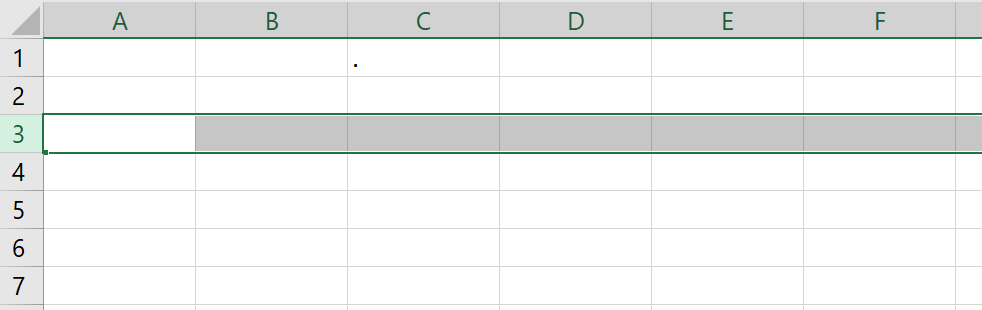

# taller de computacion :computer:
## tarea 998

## 21/08/2025 

hoy inicie sesion en discord y me puse al corriente con mis tareas

## tarea 996
[cvespañol](CV.pdf)

[cvingles](Cvingles.pdf)

## tarea 995

Todo Microsoft Office 2016 incluye el área Backstage. En Backstage, puedes administrar, guardar y abrir tus archivos. Aquí también puedes imprimir, seleccionar plantillas y realizar otras tareas útiles. Analicemos el Backstage en profundidad. Primero, haz clic en la pestaña Archivo (en la esquina superior izquierda de la ventana).

La primera página que verá es la página de información. Esta página muestra el nombre, el tamaño y los autores de su archivo. También puede ver cuándo se realizó el último autoguardado. El autoguardado es la red de seguridad de Office. Periódicamente, su computadora guardará automáticamente su archivo como archivo temporal. Si se apaga su computadora, puede recuperar parte de su trabajo desde el autoguardado.

Nuevo: Puede crear un documento nuevo en blanco o seleccionarlo de la biblioteca de plantillas de Word.
Word ofrece plantillas de currículum, calendario y folletos para ayudarle a empezar.
Abrir: Haga clic en esta opción para abrir un archivo previamente guardado y seguir editándolo.
Guardar: Guarde su archivo con frecuencia. También puede hacer clic en en la esquina superior izquierda o presionar CTRL + S en el teclado simultáneamente.
Guardar como: La primera vez que guarde su archivo, verá el menú Guardar como. Consulte a continuación para obtener más información.
Guardar como Adobe PDF: Le permite guardar el documento como un archivo Adobe PDF.
Imprimir: Imprima su documento usando esta pantalla. Más adelante en la clase, explicaremos más detalles sobre esto.
Compartir: Esta función es nueva en Office 2016. Le permite enviar su archivo por correo electrónico, subirlo a un blog o presentarlo en línea. Necesitará cuentas adicionales para usar estas funciones, como una cuenta de Microsoft (para presentaciones) o una cuenta de WordPress (para blogs).
En esta introducción no profundizaremos en estas funciones, pero tenga en cuenta que existen.
Exportar: Permite exportar (o guardar) su documento como un tipo diferente.
Cuenta: Permite cambiar los colores del fondo de Office e iniciar sesión con otra cuenta de Microsoft si es necesario.
Opciones: Permite acceder a las funciones avanzadas de Word. Esta función también permite reorganizar la cinta de opciones u otras configuraciones de la aplicación.

La Cinta
La Cinta es un panel que contiene grupos funcionales de botones y listas desplegables, organizados en pestañas. Cada producto de Office cuenta con un conjunto de pestañas que corresponden a la funcionalidad de la aplicación. Cada pestaña se divide a su vez en grupos como Fuente y Párrafo.

En la esquina inferior derecha de algunos grupos, hay una flecha diagonal llamada Iniciador de cuadro de diálogo (ver Figura 4). Al hacer clic en este botón, se abre un cuadro de diálogo para ese grupo con más opciones.

Figura 4 - Lanzador de diálogos Aparecerán pestañas contextuales según la tarea en la que esté trabajando. Por ejemplo, si ha insertado imágenes, la pestaña aparecerá al seleccionar una imagen.

Figura 5 – Pestaña contextual
Personalización de la cinta de opciones
Puede ocultar o mostrar las pestañas que no utiliza o crear su propia pestaña de herramientas favoritas. A continuación, se explica cómo personalizar la cinta de opciones para crear sus propias pestañas y grupos.

Figura 6 - Pestaña Archivo (Vista Backstage)

✓ En la Vista Backstage, haga clic en Opciones.

✓ En el cuadro de diálogo Opciones de Word, haga clic en Personalizar Cinta (Ver Figura 7).

✓ Haga clic en el botón Nueva pestaña (Ver Figura 7).

✓ Se ha añadido una Nueva pestaña a la lista de Pestañas principales. En Nueva pestaña, verá que Nuevo grupo ya está seleccionado (Ver Figura 7).

✓ En la columna de la izquierda, seleccione un comando de la lista en Elegir comandos de para añadirlo al Nuevo grupo (Ver Figura 7).

✓ Haga clic en el botón Añadir (Ver Figura 7).

✓ El comando se añadirá a la pestaña Nuevo grupo.

✓ Para cambiar el nombre de la pestaña o el grupo, haga clic con el botón derecho en la Nueva pestaña o el Nuevo grupo (Ver Figura 8).

✓ Haga clic en Cambiar nombre (Ver Figura 8).

✓ Para ocultar una pestaña, quite la marca de verificación junto al nombre de la pestaña (ver Figura 8)

tarea #99
Rango en Excel
 
Un rango en Excel es una colección de dos o más celdas. Este capítulo ofrece una descripción general de algunas operaciones de rango muy importantes.

•	Celda, Fila, Columna
Comencemos seleccionando una celda, una fila y una columna.

1. Para seleccionar la celda C3, haga clic en el cuadro en la intersección de la columna C y la fila 3.

Seleccionar una celda

2. Para seleccionar la columna C, haga clic en el encabezado de la columna C.

Seleccionar una columna en Excel

3. Para seleccionar la fila 3, haga clic en el encabezado de la fila 3.

Seleccione una fila

Ejemplos de rango
Un rango es una colección de dos o más celdas.

1. Para seleccionar el rango B2:C4, haga clic en la celda B2 y arrástrela a la celda C4.

Rango en Excel

2. Para seleccionar un rango de celdas individuales, mantenga presionada la tecla CTRL y haga clic en cada celda que desee incluir en el rango.

•	Una gama de células individuales

Rellenar un rango
Para llenar un rango, ejecute los siguientes pasos.

1a. Ingrese el valor 2 en la celda B2.

Introduzca un valor

1b. Seleccione la celda B2, haga clic en la esquina inferior derecha de la celda B2 y arrástrela hasta la celda B8.
Resultado:

Esta técnica de arrastrar es muy importante y la usarás con mucha frecuencia en Excel. Aquí tienes otro ejemplo
2a. Ingrese el valor 2 en la celda B2 y el valor 4 en la celda B3.

Un patrón

2b. Seleccione las celdas B2 y B3, haga clic en la esquina inferior derecha de este rango y arrástrelo hacia abajo.

Patrón arrastrado hacia abajo

Excel rellena automáticamente el rango según el patrón de los dos primeros valores. Genial, ¿verdad? Aquí tienes otro ejemplo.

3a. Ingrese la fecha 13/6/2030 en la celda B2 y la fecha 16/6/2030 en la celda B3.

3b. Seleccione las celdas B2 y B3, haga clic en la esquina inferior derecha de este rango y arrástrelo hacia abajo.

•	Mover un rango
Para mover un rango, ejecute los siguientes pasos.

1. Seleccione un rango y haga clic en el borde del rango.

2. Arrastre el rango a su nueva ubicación.

Resultado del movimiento

Copiar/Pegar un rango
Para copiar y pegar un rango, ejecute los siguientes pasos.

1. Seleccione el rango, haga clic derecho y luego haga clic en Copiar (o presione CTRL + c).

